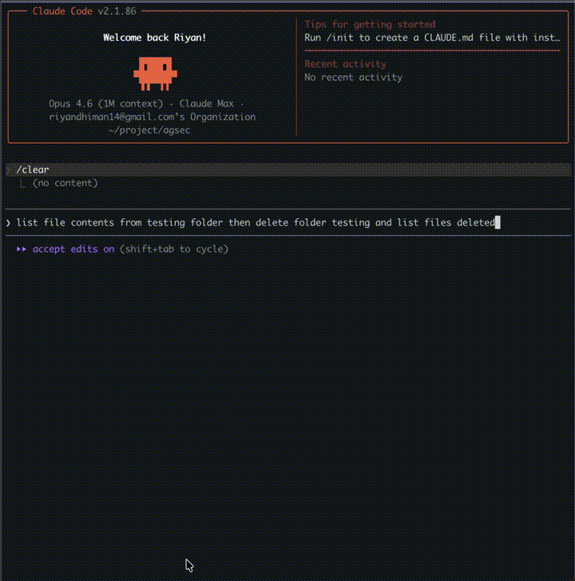
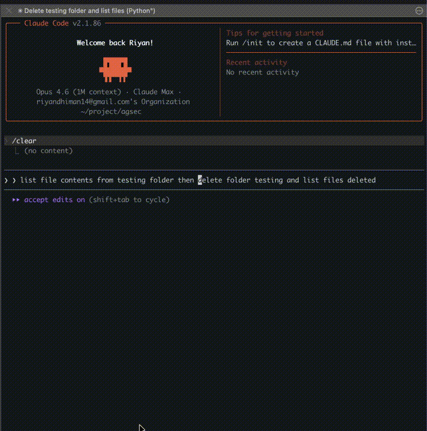
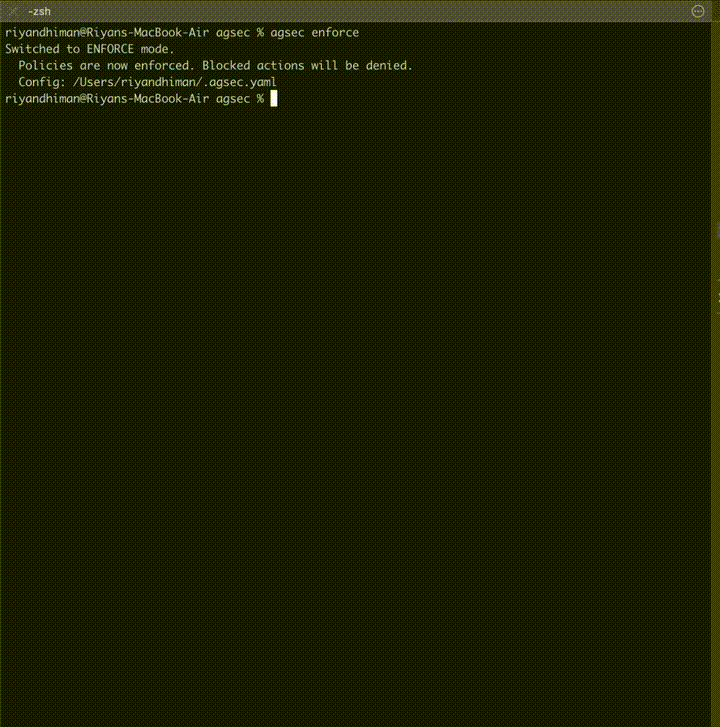

# agsec

[](https://pypi.org/project/agsec/)
[](https://www.python.org/downloads/)
[](https://opensource.org/licenses/Apache-2.0)
[](docs/owasp-mapping.md)

---

**Your AI agent has shell access. File access. Network access. Git access.**

**There are no guardrails by default.**

AgSec is a policy engine for AI agents - like AWS IAM, but for what agents can do on your machine. Write declarative YAML policies. Every action gets checked at runtime before it executes. Deny always wins.

```
agent wants to act  →  agsec evaluates policy  →  allow / deny / review  →  real world
```

---

## See it in action

### Without agsec — Claude deletes files freely
<p align="center">
  
</p>

### With agsec — dangerous action blocked
<p align="center">
  
</p>

### agsec analyze — threat analysis
<p align="center">
  
</p>

---

## The problem

You give Claude Code, Cursor, or Codex access to your terminal. It tries to be helpful. Sometimes it runs `rm -rf`. Writes to `.env`. Force-pushes to main. Makes an API call you didn't expect.

It's not malicious. It's just that agents have no blast radius limit unless you give them one.

agsec is that limit.

---

## 3-command setup

```bash
pip install agsec
agsec init                    # scaffold default policies
agsec install claude-code     # activate the firewall
```

Done. Every tool call is now checked against your policies. Out of the box, the following are blocked:

- `rm`, `rm -rf`, `rmdir` — destructive deletes
- Writes to `.env`, `.env.*`, secrets files
- `git push --force` — force pushes
- `DROP TABLE`, `DELETE FROM` without WHERE — destructive SQL
- Reads of `~/.ssh`, `~/.aws`, `~/.gnupg` — credential directories

---

## Not ready to block yet? Start in Observe Mode

```bash
agsec init --observe          # log everything, block nothing
agsec audit --stats           # see what would have been blocked
agsec enforce                 # start blocking when ready
```

Observe mode gives you a full audit trail of every action your agent attempted — with zero disruption to your workflow. See the blast radius before you enforce it.

---

## Write your own policies

```yaml
version: "1.0"
default: deny

statements:
  - sid: "AllowReadOps"
    effect: allow
    actions: ["file.read", "file.glob", "file.grep"]

  - sid: "BlockDeletes"
    effect: deny
    actions: ["bash.execute"]
    conditions:
      params.command:
        op: "regex"
        value: "\\brm\\s"
    reason: "Agents should not delete files"

  - sid: "ReviewLargePayments"
    effect: review               # pause and ask a human
    actions: ["payment.create"]
    conditions:
      params.amount:
        op: "gt"
        value: 10000

  - sid: "AllowBash"
    effect: allow
    actions: ["bash.execute"]
```

Three effects: `allow`, `deny`, `review` (human-in-the-loop pause). Deny always wins — same evaluation logic as AWS IAM. Layered policy evaluation (project + agent layers) where each layer is a gate. Supports 14 condition operators: `==`, `!=`, `>`, `<`, `>=`, `<=`, `in`, `not_in`, `contains`, `starts_with`, `ends_with`, `regex`, `exists`, `not_exists`.

---

## Supported platforms

### System agents — hook-based enforcement

```bash
agsec install claude-code     # Claude Code + Claude Cowork ✓ tested
agsec install codex           # OpenAI Codex
agsec install cursor          # Cursor
agsec install windsurf        # Windsurf (Codeium)
agsec install cline           # Cline
agsec install copilot         # GitHub Copilot (project + user level)
```

Claude Code and Claude Cowork are fully tested. Others are functional — community testing welcome.

### Python frameworks

**LangChain:**

```python
from agsec.integrations.langchain import guard, allow, deny, review, param

agent = create_react_agent(llm, guard(
    allow(search, calculator),
    review(send_email),
    deny(delete_record),
    deny(payment).when(param("amount") > 10000),
))
```

**OpenAI / Anthropic / OpenRouter:**

```python
from agsec.integrations.openai import protect, deny, param

client = protect(OpenAI(),
    deny("delete_user"),
    deny("payment").when(param("amount") > 10000),
)
# Works with OpenRouter, Groq, Together — anything OpenAI-compatible
```

**Any Python function:**

```python
from agsec import guard

@guard("email.send")
def send_email(to, subject, body):
    ...
```

---

## CLI reference

```bash
agsec init [--observe]        # scaffold policies
agsec install <platform>      # activate firewall
agsec uninstall <platform>    # deactivate

agsec policy list             # view all rules
agsec policy add              # add a rule (interactive)
agsec policy remove <sid>     # remove a rule
agsec validate                # check for errors

agsec audit [--stats]         # view action log
agsec analyze [--hours N]     # threat analysis with blast radius
agsec observe                 # switch to observe mode
agsec enforce                 # switch to enforce mode

agsec halt                    # kill switch: block ALL actions immediately
agsec resume                  # restore from halt
```

---

## OWASP Agentic Top 10 coverage

agsec addresses 7 of the 10 OWASP Agentic Top 10 risks out of the box. See the [full mapping](docs/owasp-mapping.md).

---

## Documentation

- [Policy Format](docs/policies.md) — schema, operators, conditions, examples
- [CLI Reference](docs/cli.md) — all commands
- [Integrations](docs/integrations.md) — Claude Code, Codex, Cursor, Windsurf, Cline, Copilot, LangChain, OpenAI, Anthropic
- [SDK Usage](docs/sdk.md) — programmatic Python API
- [Observe Mode](docs/observe-mode.md) — audit-first workflow
- [OWASP Mapping](docs/owasp-mapping.md) — compliance reference

---

## Contributing

See [CONTRIBUTING.md](CONTRIBUTING.md). Issues and PRs welcome — especially platform testing reports for Codex, Cursor, Windsurf, and Cline.

## License

Apache 2.0 — see [LICENSE](LICENSE).